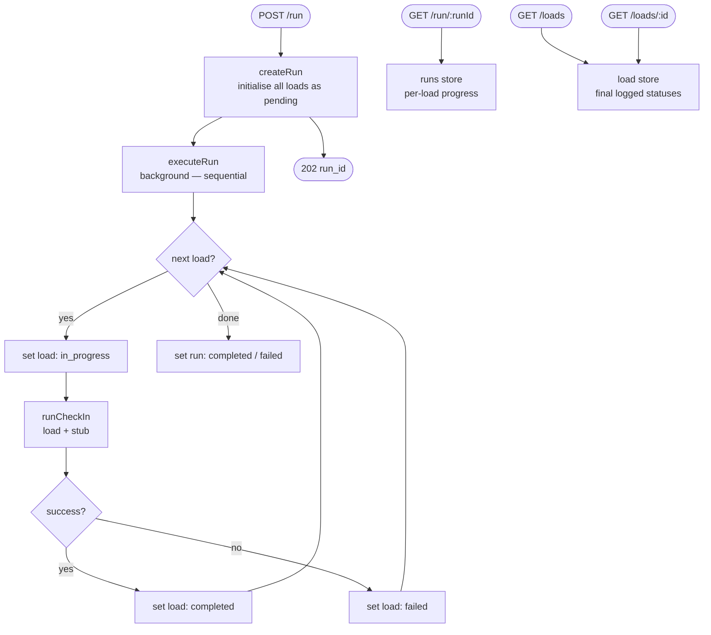
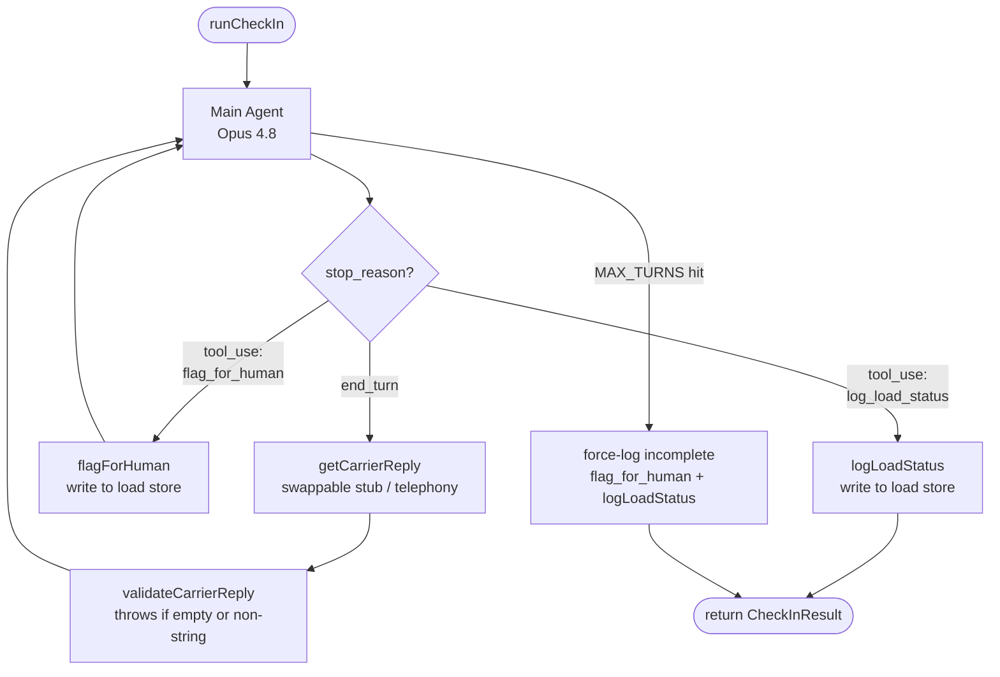

# Outbound Carrier Check-In Agent

A demo AI agent for HappyRobot that autonomously conducts outbound carrier check-in calls. A single API call kicks off a sequential run across all active loads — the agent calls each carrier, gathers location and ETA, escalates problems to human dispatchers, and always closes by logging the final load status.

---

## What It Does

When loads are in transit, a dispatcher normally calls each carrier to confirm location and ETA. This agent automates that entire batch:

1. A `POST /run` request triggers the agent to begin checking in on all loads, one at a time
2. For each load, the agent opens a call, identifies itself, and works through three questions — current location, ETA, and whether there are any issues — one at a time. If the carrier volunteers information early, the agent skips that question and moves on
3. If at any point the carrier's reply indicates a breakdown, accident, or major delay, the agent calls `flag_for_human` immediately to alert a dispatcher
4. Every call ends with `log_load_status` — no exceptions, whether the call was clean or escalated
5. The client polls `GET /run/:runId` to track progress as each load is checked in
6. `GET /loads` returns the final logged status for all loads once the run completes

---

## Architecture

### System Level



### Agent Level — inside each `runCheckIn`



### Two Stores

| Store | Where | What it tracks |
|---|---|---|
| Run store (`runs.ts`) | `Map<runId, Run>` | Real-time job progress — which loads are pending, in_progress, completed, or failed |
| Load store (`store.ts`) | `Map<loadId, LoadStatus>` | Final dispatched record — written by `log_load_status` at the end of each check-in |

These are intentionally separate. The run store is ephemeral job state. The load store is the permanent record of what was logged.

---

## Key Design Decisions

**Async job pattern**
`POST /run` returns a `run_id` immediately (`202 Accepted`) and processes loads in the background. The client polls `GET /run/:runId` until `status` is no longer `"in_progress"`. This keeps the HTTP layer non-blocking and sets up Stage 3 for live progress display.

**Sequential processing — one load at a time**
`executeRun` iterates through loads one by one. Each load is set to `"in_progress"`, `runCheckIn` is awaited, then it moves to the next. Simpler to debug, easier to read in logs, and avoids parallel API call overhead for a demo.

**Single LLM loop — one model, no classifier**
The main agent (`claude-opus-4-8`) drives the full conversation and makes every decision, including when to escalate. Escalation happens when the agent calls the `flag_for_human` tool based on the meaning of what the carrier says — not keyword matching.

The system prompt defines a three-question protocol (location → ETA → any issues?) and instructs the agent to skip a question if the carrier already answered it unprompted. Three concrete escalation examples are embedded so the agent generalises to phrasings it hasn't seen before: "blew a tire," "knocking from the engine," "got rear-ended."

**`log_load_status` always fires, always last**
The loop code breaks the moment `log_load_status` is detected in a tool response — not by trusting `stop_reason === "end_turn"`. If the loop exits without it (turn cap hit or unexpected break), the code force-logs an incomplete status and calls `flag_for_human` so a dispatcher knows to follow up. The load store always has a record; a check-in never silently disappears.

**Flagged-state preservation**
`logLoadStatus` reads the existing store entry before writing, so if `flag_for_human` was called earlier in the same call, the final record correctly shows `status: "needs_attention"`. The flag is never lost when the log is written.

**Swappable carrier reply source**
`runCheckIn` takes `getCarrierReply: (agentMessage: string) => Promise<string>` as a parameter. Currently this is a hardcoded stub. Replacing it with a telephony/STT integration requires no changes to the agent loop.

---

## API Reference

### `POST /run`
Starts a new sequential check-in run across all loads.

**Response `202`**
```json
{
  "run_id": "a3f9c2d1-...",
  "status": "in_progress",
  "total": 5
}
```

---

### `GET /run/:runId`
Poll the status of a run. Returns per-load progress and aggregate counts.

**Response `200`**
```json
{
  "run_id": "a3f9c2d1-...",
  "status": "in_progress",
  "progress": {
    "pending": 2,
    "in_progress": 1,
    "completed": 2,
    "failed": 0
  },
  "loads": [
    { "load_id": "LOAD-001", "status": "completed" },
    { "load_id": "LOAD-002", "status": "completed" },
    { "load_id": "LOAD-003", "status": "in_progress" },
    { "load_id": "LOAD-004", "status": "pending" },
    { "load_id": "LOAD-005", "status": "pending" }
  ],
  "started_at": "2026-06-15T14:00:00.000Z",
  "finished_at": null
}
```

`status` values: `"in_progress"` → `"completed"` or `"failed"`

---

### `GET /loads`
Returns all load statuses currently in the store. Empty array until at least one check-in completes.

**Response `200`** — array of `LoadStatus`

---

### `GET /loads/:id`
Returns the status for a single load.

**Response `200`**
```json
{
  "load_id": "LOAD-005",
  "status": "needs_attention",
  "current_location": "I-85 North, mile marker 85, near Spartanburg, SC",
  "eta": "4-5 hours, pending roadside assistance",
  "notes": "Carrier reported blown tire. Broken down on shoulder.",
  "flagged": true,
  "flag_reason": "Carrier reported breakdown — blown tire, waiting for roadside",
  "updated_at": "2026-06-15T14:22:11.000Z"
}
```

**Response `404`** — load not yet checked in or does not exist

---

## Agent Tools

### `log_load_status`
Records the final outcome of the check-in. Called at the end of every call — clean or escalated.

| Field | Type | Description |
|---|---|---|
| `load_id` | string | The load being checked in |
| `current_location` | string | Carrier's reported location |
| `eta` | string | Estimated arrival time |
| `notes` | string | Call summary; includes problem description if escalated |

### `flag_for_human`
Flags a load for immediate dispatcher attention. Called before `log_load_status` when the carrier reports a breakdown, accident, or major unresolvable delay.

| Field | Type | Description |
|---|---|---|
| `load_id` | string | The load being flagged |
| `reason` | string | Specific reason for escalation |

---

## Project Structure

```
outbound-agent/
├── src/
│   ├── types.ts       — Load, LoadStatus, GetCarrierReply, CheckInResult
│   ├── store.ts       — Load store; logLoadStatus(), flagForHuman(), getAllStatuses()
│   ├── mockData.ts    — 5 mock loads (LOAD-001 → LOAD-005)
│   ├── stubs.ts       — Carrier reply stubs; per-route responses; stubForLoad(load)
│   ├── agent.ts       — Tools, system prompt, main agent loop
│   ├── runs.ts        — Run store; createRun(), executeRun() sequential loop
│   └── server.ts      — Express app; POST /run, GET /run/:id, GET /loads, GET /loads/:id
├── scripts/
│   └── test-checkin.ts — Stage 1 terminal test runner
├── .env               — ANTHROPIC_API_KEY (git-ignored)
├── .env.example       — key template for new contributors
├── .gitignore
├── package.json
└── tsconfig.json
```

### `src/types.ts`
Shared interfaces: `Load`, `LoadStatus`, `GetCarrierReply`, `CheckInResult`.

### `src/store.ts`
Permanent load status store. `logLoadStatus` preserves any prior `flagged` state — if the agent calls `flag_for_human` before `log_load_status`, the final record correctly shows `status: "needs_attention"`.

### `src/stubs.ts`
Carrier reply stubs used during development. Both `makeCleanStub(load)` and `makeEscalationStub(load)` take a `Load` and return a turn-counter function that produces the next pre-written carrier line each time the agent speaks. Clean responses are route-aware — each load ID maps to geographically appropriate replies (e.g. LOAD-001 Chicago→Dallas says "just passed Waco"). `stubForLoad(load)` auto-selects: LOAD-005 → escalation, all others → clean. Will be replaced by telephony/STT in production.

### `src/agent.ts`
The check-in agent. Contains tool definitions, system prompt builder, `validateCarrierReply` type guard, and `runCheckIn` — the manual Anthropic API tool-use loop.

### `src/runs.ts`
Job store and execution engine. `createRun()` initialises a run with all loads as `"pending"`. `executeRun()` iterates sequentially, calling `runCheckIn` for each load and updating progress status. The run's final `status` is `"failed"` if any load failed, otherwise `"completed"`.

### `src/server.ts`
Express API server. CORS enabled for Stage 3. `POST /run` fires `executeRun` in the background and returns immediately; the load-level `.catch` inside `executeRun` prevents one failed load from crashing the whole run.

### `scripts/test-checkin.ts`
Stage 1 terminal test — runs individual check-ins directly without the API layer. Imports stubs from `src/stubs.ts`.

---

## Setup

**Prerequisites:** Node.js 18+, an Anthropic API key.

```bash
npm install
cp .env.example .env
# then open .env and add your key:
# ANTHROPIC_API_KEY=sk-ant-...
```

---

## Running

### API server (Stage 2)
```bash
npm start
# → HappyRobot check-in API → http://localhost:3000

# Start a run
curl -X POST http://localhost:3000/run

# Poll progress
curl http://localhost:3000/run/<run_id>

# See all load statuses
curl http://localhost:3000/loads

# Single load
curl http://localhost:3000/loads/LOAD-005
```

### Terminal test (Stage 1)
```bash
# Single clean check-in — LOAD-001, Smith Trucking, Chicago → Dallas
npm run test:clean

# Escalation path — LOAD-005, Southeastern Trucking, Atlanta → Charlotte
npm run test:escalation

# Run both and print combined store state
npm run test:all
```

---

## Models

| Role | Model | Why |
|---|---|---|
| Main agent | `claude-opus-4-8` | Drives the full conversation — speaks to carrier, calls tools, detects and escalates problems |

## Dependencies

| Package | Purpose |
|---|---|
| `@anthropic-ai/sdk` | Anthropic API client — messages, tool use |
| `express` | HTTP server |
| `cors` | Cross-origin headers for Stage 3 frontend |
| `dotenv` | Loads `ANTHROPIC_API_KEY` from `.env` |

---

## Stage Roadmap

| Stage | Status | Description |
|---|---|---|
| 1 | ✅ Complete | Terminal agent module — tools, loop, escalation via tool call, carrier stubs |
| 2 | ✅ Complete | Express API — `POST /run`, `GET /run/:id`, `GET /loads`, `GET /loads/:id` |
| 3 | Pending | React + Vite frontend — live load board, run trigger, real-time progress display |
