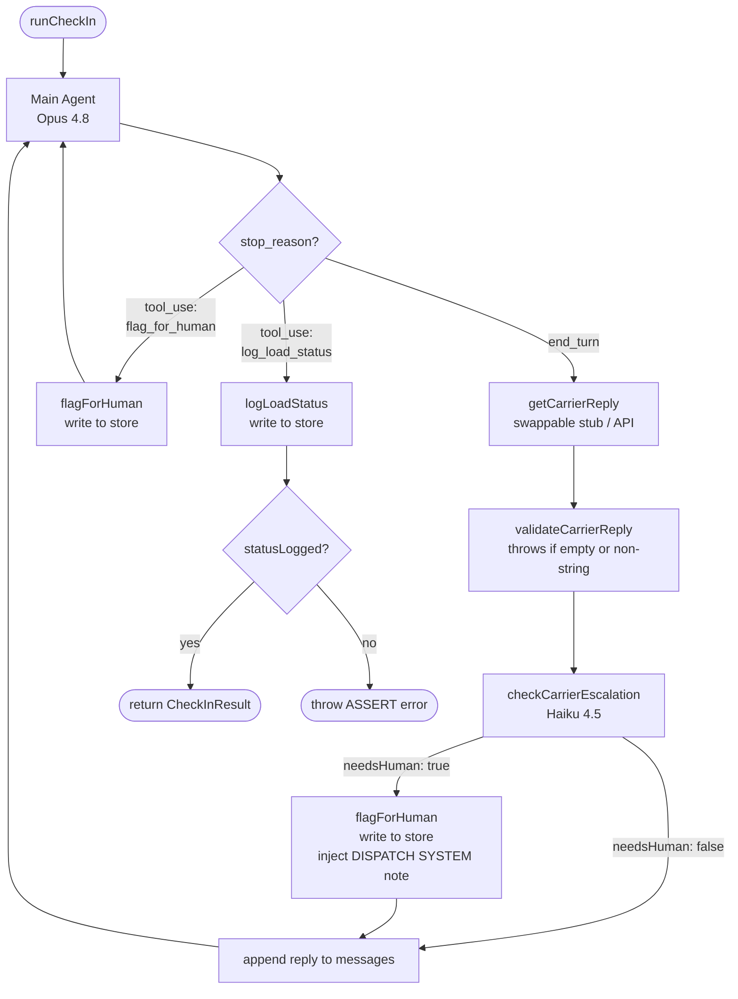

# Outbound Carrier Check-In Agent

A demo AI agent for HappyRobot that autonomously conducts outbound carrier check-in calls. The agent gathers location and ETA from carriers, runs an escalation check on every reply, flags problems for human dispatchers, and always closes by logging the final load status.

---

## What It Does

When a load is in transit, a dispatcher normally calls each carrier to confirm their current location and estimated arrival time. This agent automates that call:

1. Opens the conversation identifying itself, the company, and the load
2. Asks for the carrier's current location (one question at a time)
3. Asks for the ETA
4. On every carrier reply, runs a fast LLM escalation check to detect breakdowns, accidents, or major delays
5. If the escalation check fires, flags the load for a human dispatcher immediately
6. Always ends the call by logging the final status — no exceptions

---

## Architecture



### Key Design Decisions

**Single LLM loop, not a chatbot + classifier**
The main agent (`claude-opus-4-8`) drives the conversation, calls tools, and decides when to escalate. It is not a router. Escalation happens via the `flag_for_human` tool, not by dispatching to a separate model.

**Per-reply escalation pre-check**
Before each carrier reply reaches the main agent, it is passed through a fast `claude-haiku-4-5` call that returns `{ needsHuman: boolean, reason: string }`. If `needsHuman` is true:
- `flagForHuman()` is called directly on the store (the decision is made immediately)
- A `[DISPATCH SYSTEM]` annotation is injected into the message so the main agent knows to wrap up

The main agent may also call `flag_for_human` on its own for problems it detects independently. Both paths converge on the store — the result is idempotent.

**`log_load_status` always fires, always last**
The system prompt instructs the agent to call `log_load_status` at the end of every check-in. The loop code enforces this independently: it watches for the `log_load_status` tool call and breaks the loop the moment it fires. A post-loop assertion (`if (!statusLogged) throw`) catches any edge case where the tool was never called.

**The loop code controls termination — not the model**
The loop does not break on `stop_reason === "end_turn"` to decide the call is done. It only breaks when `log_load_status` is detected in a `tool_use` response. This prevents the model from silently ending a call before logging.

**Swappable carrier reply source**
`runCheckIn` takes `getCarrierReply: (agentMessage: string) => Promise<string>` as a parameter. In tests this is a hardcoded stub. In production it will be replaced with a real telephony/STT integration — the agent loop is unchanged.

**No database**
All load statuses are stored in a `Map<string, LoadStatus>` in memory. Sufficient for a single-process demo.

---

---

## Tools

### `log_load_status`
Records the final outcome of the check-in. The agent calls this at the end of every conversation — clean or escalated.

| Field | Type | Description |
|---|---|---|
| `load_id` | string | The load being checked in |
| `current_location` | string | Carrier's reported location |
| `eta` | string | Estimated arrival time |
| `notes` | string | Call summary; includes problem description if escalated |

### `flag_for_human`
Flags a load for immediate dispatcher attention. Called before `log_load_status` when the carrier reports a breakdown, accident, or major unresolvable delay.

| Field | Type | Description |
|---|---|---|
| `load_id` | string | The load being flagged |
| `reason` | string | Specific reason for escalation |

---

## Project Structure

```
outbound-agent/
├── src/
│   ├── types.ts       — Load, LoadStatus, GetCarrierReply, CheckInResult
│   ├── store.ts       — In-memory Map; logLoadStatus(), flagForHuman()
│   ├── mockData.ts    — 5 mock loads (LOAD-001 → LOAD-005)
│   └── agent.ts       — Tools, system prompt, escalation check, main loop
├── scripts/
│   └── test-checkin.ts — Terminal test runner with clean + escalation stubs
├── package.json
└── tsconfig.json
```

### `src/types.ts`
Shared interfaces used across all modules.

### `src/store.ts`
In-memory load status store. `logLoadStatus` preserves any prior `flagged` state set by `flagForHuman`, so if the pre-check escalation fires before the main agent calls `log_load_status`, the final record correctly shows `status: "needs_attention"`.

### `src/agent.ts`
Contains:
- `TOOLS` — Anthropic tool schema definitions for both tools
- `buildSystemPrompt(load)` — constructs the per-call system prompt with load details injected
- `validateCarrierReply(raw)` — runtime type guard; throws on non-string or empty reply
- `checkCarrierEscalation(reply, loadId)` — `claude-haiku-4-5` call returning `{ needsHuman, reason }`
- `runCheckIn(load, getCarrierReply)` — the main agent loop

### `scripts/test-checkin.ts`
Hardcoded stubs simulating carrier conversations:
- **`makeCleanStub()`** — smooth check-in; returns location on turn 1, ETA on turn 2
- **`makeEscalationStub()`** — broken-down carrier; reports blown tire on turn 1

---

## Setup

**Prerequisites:** Node.js 18+, an Anthropic API key.

```bash
npm install
export ANTHROPIC_API_KEY=sk-ant-...
```

---

## Running Tests

```bash
# Clean check-in — LOAD-001, Swift Transport, Chicago → Nashville
npm run test:clean

# Escalation path — LOAD-005, Southeastern Trucking, Atlanta → Charlotte
# Carrier reports a blown tire; escalation check fires on first reply
npm run test:escalation

# Run both back-to-back and print combined store state
npm run test:all
```

---

## Models Used

| Role | Model | Why |
|---|---|---|
| Main agent | `claude-opus-4-8` | Drives the conversation, calls tools, makes nuanced decisions |
| Escalation check | `claude-haiku-4-5` | Fast, cheap; runs on every carrier reply for a simple yes/no decision |

---

## Stage Roadmap

| Stage | Status | Description |
|---|---|---|
| 1 | ✅ Complete | Terminal agent module — tools, loop, escalation check, test stubs |
| 2 | Pending | Express API wrapper exposing `POST /check-in` and `GET /loads` |
| 3 | Pending | React + Vite frontend — live load board, check-in trigger, status display |
