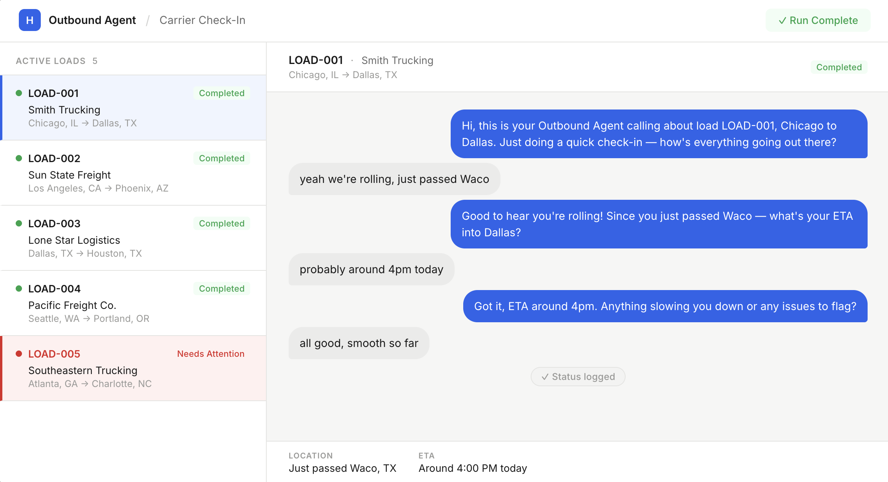
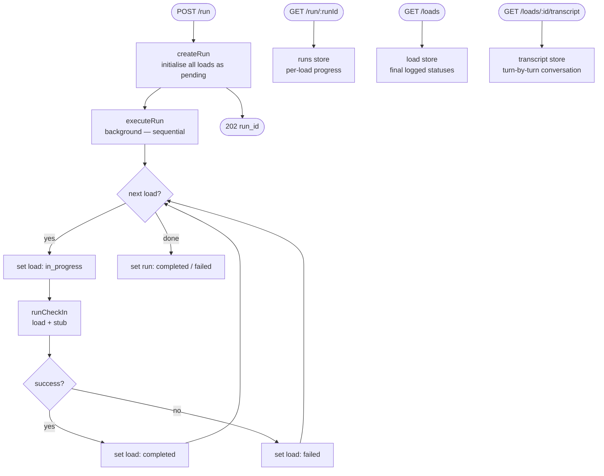
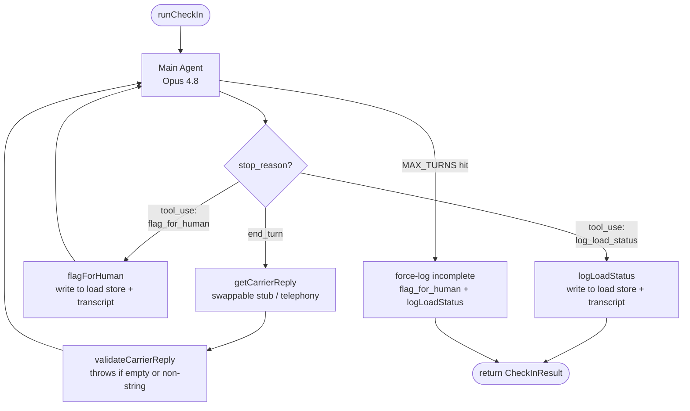

# Outbound Carrier Check-In Agent

An AI agent that autonomously conducts outbound carrier check-in calls. A single API call kicks off a sequential run across all active loads — the agent calls each carrier, gathers location and ETA, escalates problems to human dispatchers, and always closes by logging the final load status. A live dispatcher dashboard streams each conversation turn by turn as it happens.



---

## What It Does

When loads are in transit, a dispatcher normally calls each carrier to confirm location and ETA. This agent automates that entire batch:

1. A `POST /run` request triggers the agent to begin checking in on all loads, one at a time
2. For each load, the agent opens a call, identifies itself, and works through three questions — current location, ETA, and whether there are any issues — one at a time. If the carrier volunteers information early, the agent skips that question and moves on
3. If at any point the carrier's reply indicates a breakdown, accident, or major delay, the agent calls `flag_for_human` immediately to alert a dispatcher
4. Every call ends with `log_load_status` — no exceptions, whether the call was clean or escalated
5. The client polls `GET /run/:runId` to track progress as each load is checked in
6. A React dashboard streams each conversation live, reveals turns one at a time with typing indicators, and flips the board row red the moment a flag event is revealed

---

## Architecture

### System Level



### Agent Level — inside each `runCheckIn`



### Three Stores

| Store | Where | What it tracks |
|---|---|---|
| Run store (`runs.ts`) | `Map<runId, Run>` | Real-time job progress — which loads are pending, in_progress, completed, or failed |
| Load store (`store.ts`) | `Map<loadId, LoadStatus>` | Final dispatched record — written by `log_load_status` at the end of each check-in |
| Transcript store (`transcriptStore.ts`) | `Map<loadId, Turn[]>` | Turn-by-turn conversation log — written as the agent loop runs, polled by the dashboard |

The run and transcript stores are ephemeral job state. The load store is the permanent record of what was logged.

---

## Key Design Decisions

**Async job pattern**
`POST /run` returns a `run_id` immediately (`202 Accepted`) and processes loads in the background. The client polls `GET /run/:runId` until `status` is no longer `"in_progress"`. This keeps the HTTP layer non-blocking.

**Sequential processing — one load at a time**
`executeRun` iterates through loads one by one. Each load is set to `"in_progress"`, `runCheckIn` is awaited, then it moves to the next. Simpler to debug, easier to read in logs, and avoids parallel API call overhead for a demo.

**Single LLM loop — one model, no classifier**
The main agent (`claude-opus-4-8`) drives the full conversation and makes every decision, including when to escalate. Escalation happens when the agent calls the `flag_for_human` tool based on the meaning of what the carrier says — not keyword matching.

The system prompt defines a three-question protocol (location → ETA → any issues?) and instructs the agent to skip a question if the carrier already answered it unprompted. Three concrete escalation examples are embedded so the agent generalises to phrasings it hasn't seen before: "blew a tire," "knocking from the engine," "got rear-ended."

**`log_load_status` always fires, always last**
The loop code breaks the moment `log_load_status` is detected in a tool response — not by trusting `stop_reason === "end_turn"`. If the loop exits without it (turn cap hit or unexpected break), the code force-logs an incomplete status and calls `flag_for_human` so a dispatcher knows to follow up. The load store always has a record; a check-in never silently disappears.

**Flagged-state preservation**
`logLoadStatus` reads the existing store entry before writing, so if `flag_for_human` was called earlier in the same call, the final record correctly shows `status: "needs_attention"`. The flag is never lost when the log is written.

**Synchronized escalation flip**
The dashboard drives the board row's red state from when the `flag_for_human` turn is *revealed* in the conversation, not from the raw backend status. This keeps the board and conversation panel in lockstep — the row flips red exactly when the flag event lands on screen.

**Swappable carrier reply source**
`runCheckIn` takes `getCarrierReply: (agentMessage: string) => Promise<string>` as a parameter. Currently this is a hardcoded stub. Replacing it with a telephony/STT integration requires no changes to the agent loop.

**Langfuse tracing**
Every run is traced end-to-end via OpenTelemetry. The Anthropic SDK is auto-instrumented so each `messages.create()` call is captured as a generation span. Manual `startActiveObservation` spans wrap the run and each per-load check-in, giving a full nested trace: `carrier-run → check-in → generation (turn 1, 2, 3...)`.

---

## API Reference

### `POST /run`
Starts a new sequential check-in run across all loads.

**Response `202`**
```json
{
  "run_id": "a3f9c2d1-...",
  "status": "in_progress",
  "total": 5
}
```

---

### `GET /run/:runId`
Poll the status of a run. Returns per-load progress and aggregate counts.

**Response `200`**
```json
{
  "run_id": "a3f9c2d1-...",
  "status": "in_progress",
  "progress": {
    "pending": 2,
    "in_progress": 1,
    "completed": 2,
    "failed": 0
  },
  "loads": [
    { "load_id": "LOAD-001", "status": "completed" },
    { "load_id": "LOAD-002", "status": "completed" },
    { "load_id": "LOAD-003", "status": "in_progress" },
    { "load_id": "LOAD-004", "status": "pending" },
    { "load_id": "LOAD-005", "status": "pending" }
  ],
  "started_at": "2026-06-15T14:00:00.000Z",
  "finished_at": null
}
```

`status` values: `"in_progress"` → `"completed"` or `"failed"`

---

### `GET /loads`
Returns all load statuses currently in the store. Empty array until at least one check-in completes.

**Response `200`** — array of `LoadStatus`

---

### `GET /loads/meta`
Returns static load metadata for all loads (id, origin, destination, carrier_name). Used by the dashboard to populate the board before any check-ins complete.

---

### `GET /loads/:id`
Returns the status for a single load.

**Response `200`**
```json
{
  "load_id": "LOAD-005",
  "status": "needs_attention",
  "current_location": "I-85 North, mile marker 85, near Spartanburg, SC",
  "eta": "4-5 hours, pending roadside assistance",
  "notes": "Carrier reported blown tire. Broken down on shoulder.",
  "flagged": true,
  "flag_reason": "Carrier reported breakdown — blown tire, waiting for roadside",
  "updated_at": "2026-06-15T14:22:11.000Z"
}
```

**Response `404`** — load not yet checked in or does not exist

---

### `GET /loads/:id/transcript`
Returns the conversation transcript for a load, built turn-by-turn as the agent loop runs.

**Response `200`**
```json
[
  { "id": 0, "role": "agent",   "content": "Hi, this is the Outbound Agent calling..." },
  { "id": 1, "role": "carrier", "content": "Yeah we're rolling, just passed Waco" },
  { "id": 2, "role": "tool",    "content": "Status logged.", "toolName": "log_load_status" }
]
```

`role` values: `"agent"` | `"carrier"` | `"tool"`
`toolName` values: `"flag_for_human"` | `"log_load_status"` (present when `role` is `"tool"`)

---

## Agent Tools

### `log_load_status`
Records the final outcome of the check-in. Called at the end of every call — clean or escalated.

| Field | Type | Description |
|---|---|---|
| `load_id` | string | The load being checked in |
| `current_location` | string | Carrier's reported location |
| `eta` | string | Estimated arrival time |
| `notes` | string | Call summary; includes problem description if escalated |

### `flag_for_human`
Flags a load for immediate dispatcher attention. Called before `log_load_status` when the carrier reports a breakdown, accident, or major unresolvable delay.

| Field | Type | Description |
|---|---|---|
| `load_id` | string | The load being flagged |
| `reason` | string | Specific reason for escalation |

---

## Project Structure

```
outbound-agent/
├── src/
│   ├── types.ts             — Load, LoadStatus, GetCarrierReply, CheckInResult
│   ├── store.ts             — Load store; logLoadStatus(), flagForHuman(), getAllStatuses()
│   ├── transcriptStore.ts   — Transcript store; addTurn(), getTranscript()
│   ├── mockData.ts          — 5 mock loads (LOAD-001 → LOAD-005)
│   ├── stubs.ts             — Carrier reply stubs; per-route responses; stubForLoad(load)
│   ├── agent.ts             — Tools, system prompt, main agent loop
│   ├── runs.ts              — Run store; createRun(), executeRun() sequential loop
│   ├── instrumentation.ts   — OpenTelemetry + Langfuse setup; Anthropic auto-instrumentation
│   └── server.ts            — Express app; all API endpoints
├── client/
│   ├── src/
│   │   ├── App.tsx          — Two-panel dispatcher dashboard; all polling + reveal logic
│   │   └── index.css        — Animations (bubble-in, typing dots, escalation pulse)
│   ├── index.html
│   └── vite.config.ts       — Proxies /api → localhost:3000
├── scripts/
│   └── test-checkin.ts      — Terminal test runner (bypasses API layer)
├── .env                     — API keys (git-ignored)
├── .env.example             — Key template
├── package.json
└── tsconfig.json
```

---

## Setup

**Prerequisites:** Node.js 18+, an Anthropic API key, optionally Langfuse keys for tracing.

```bash
# Backend
npm install
cp .env.example .env
# Fill in .env:
# ANTHROPIC_API_KEY=sk-ant-...
# LANGFUSE_SECRET_KEY=sk-lf-...   (optional)
# LANGFUSE_PUBLIC_KEY=pk-lf-...   (optional)
# LANGFUSE_BASE_URL=https://cloud.langfuse.com

# Frontend
cd client && npm install
```

---

## Running

### Full stack (API + dashboard)

```bash
# Terminal 1 — backend API
npm start
# → Outbound Agent API → http://localhost:3000

# Terminal 2 — frontend dashboard
cd client && npm run dev
# → http://localhost:5173
```

Open `http://localhost:5173`, click **Start Check-In Run**, and watch the board come alive.

### API only (curl)

```bash
npm start

curl -X POST http://localhost:3000/run
curl http://localhost:3000/run/<run_id>
curl http://localhost:3000/loads
curl http://localhost:3000/loads/LOAD-005
curl http://localhost:3000/loads/LOAD-001/transcript
```

### Terminal test (no API layer)

```bash
npm run test:clean        # LOAD-001, Smith Trucking, Chicago → Dallas
npm run test:escalation   # LOAD-005, Southeastern Trucking, Atlanta → Charlotte (breakdown)
npm run test:all          # both back-to-back + final store state
```

---

## Models

| Role | Model | Why |
|---|---|---|
| Main agent | `claude-opus-4-8` | Drives the full conversation — speaks to carrier, calls tools, detects and escalates problems |

## Dependencies

### Backend

| Package | Purpose |
|---|---|
| `@anthropic-ai/sdk` | Anthropic API client — messages, tool use |
| `express` | HTTP server |
| `cors` | Cross-origin headers for the frontend |
| `dotenv` | Loads env vars from `.env` |
| `@langfuse/otel` | Langfuse OpenTelemetry span processor |
| `@langfuse/tracing` | Manual trace/span creation (`startActiveObservation`) |
| `@opentelemetry/sdk-node` | OpenTelemetry Node.js SDK |
| `@arizeai/openinference-instrumentation-anthropic` | Auto-instruments Anthropic SDK calls |

### Frontend

| Package | Purpose |
|---|---|
| `react` / `react-dom` | UI framework |
| `vite` + `@vitejs/plugin-react` | Dev server and bundler |

---

## Stage Roadmap

| Stage | Status | Description |
|---|---|---|
| 1 | ✅ Complete | Terminal agent module — tools, loop, escalation via tool call, carrier stubs |
| 2 | ✅ Complete | Express API — `POST /run`, `GET /run/:id`, `GET /loads`, `GET /loads/:id` |
| 3 | ✅ Complete | React + Vite dashboard — live load board, turn-by-turn conversation reveal, escalation sync |
| 4 | ✅ Complete | Langfuse tracing — OTel auto-instrumentation, per-run and per-load spans |
